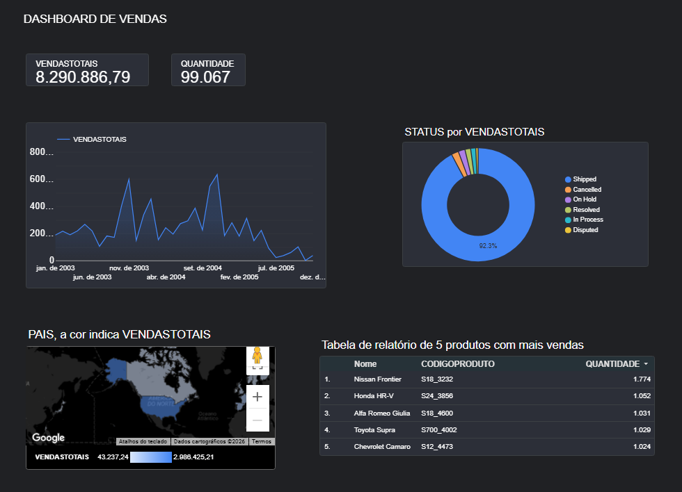

# Dashboard de Vendas

Projeto desenvolvido no Data Studio para análise de vendas.

## Ferramentas
- Data Studio (antigo Looker Studio)
- Google Sheets
- Visualização de Dados

## Principais indicadores

- Vendas Totais
- Países
- Status de Produtos
- Evolução temporal

## Arquivos
- dashboard.png
- planilhavendas.csv

## Aprendizados

Durante este projeto desenvolvi conhecimentos em:

- Importação e tratamento de dados
- Configuração de campos geográficos
- Construção de mapas coropléticos
- Criação de filtros interativos
- Storytelling com dados
- Desenvolvimento de dashboards no Looker Studio
