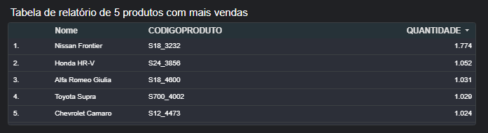

# Dashboard de Vendas

Projeto desenvolvido no Google Looker Studio para análise de vendas.

O dashboard utiliza um conjunto de dados fictício de vendas contendo informações como país, produto e valor das vendas, permitindo explorar diferentes tipos de visualizações e recursos para uma visualização de dados eficiente.

## Ferramentas
- Google Looker Studio
- Google Sheets
- Visualização de Dados

---

## 🌎 Principais visualizações

### Gráfico temporal de vendas totais

### Mapa vendas totais

### População de 10 a 14 anos

.png)

### Tabela de relatório de 5 produtos com mais vendas

---

## 📌 Principais indicadores

- Vendas Totais
- Países
- Status de Produtos
- Evolução temporal

## Arquivos
- dashboard.png
- gráfico_de_linha.png
- gráfico_de_donut_(pizza).png
- gráfico_preenchido.png
- tabela.png
- planilha_vendas.csv
- codigo_nome_do_produto.csv

## Aprendizados

Durante este projeto desenvolvi conhecimentos em:

- Importação e tratamento de dados
- Configuração de campos geográficos
- Construção de mapas coropléticos
- Criação de filtros interativos
- Storytelling com dados
- Desenvolvimento de dashboards no Looker Studio
